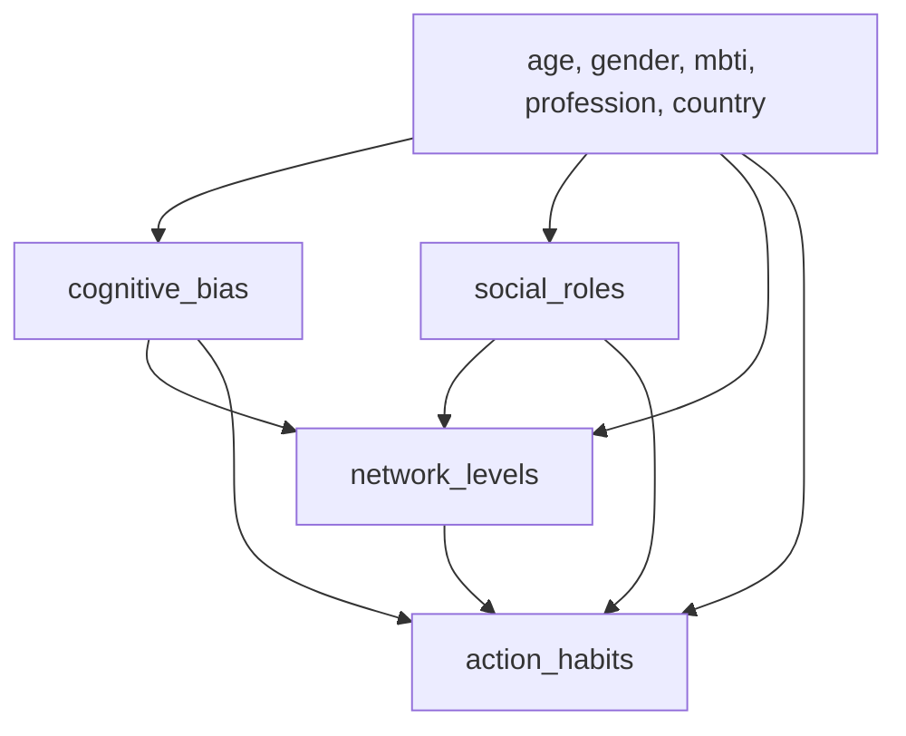

```mermaid
graph TD
    A[age, gender, mbti, profession, country] --> B[cognitive_bias]
    A --> C[social_roles]
    A --> D[network_levels]
    C --> D
    B --> D
    A --> E[action_habits]
    B --> E
    C --> E
    D --> E
```
